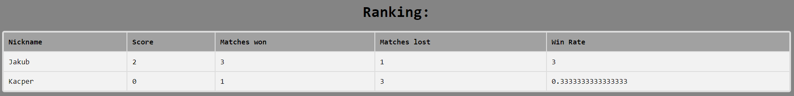
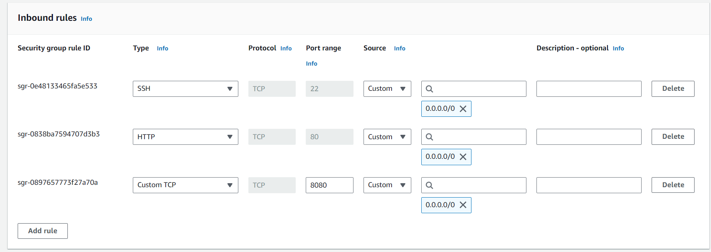
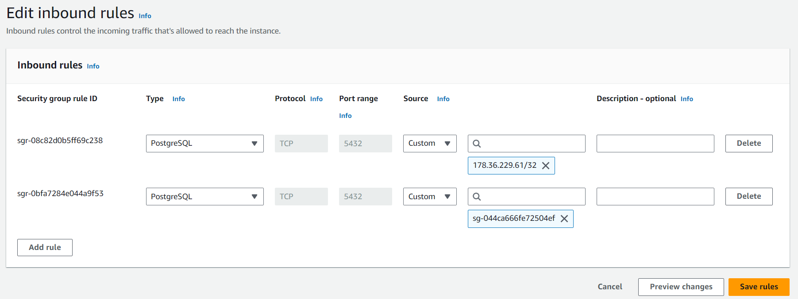
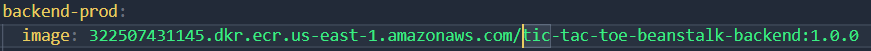
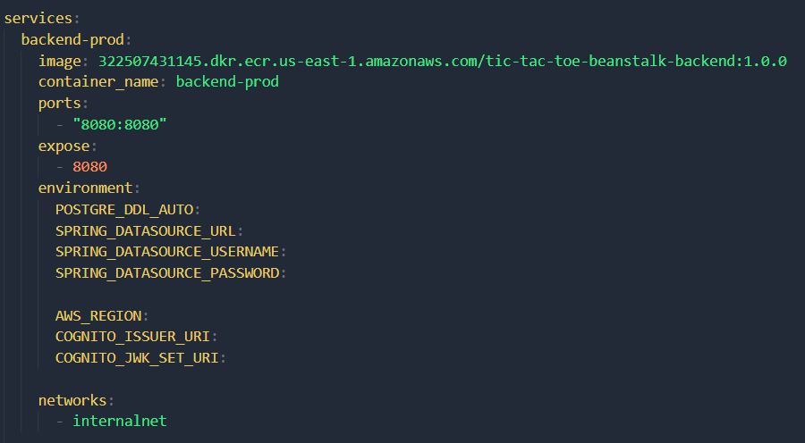
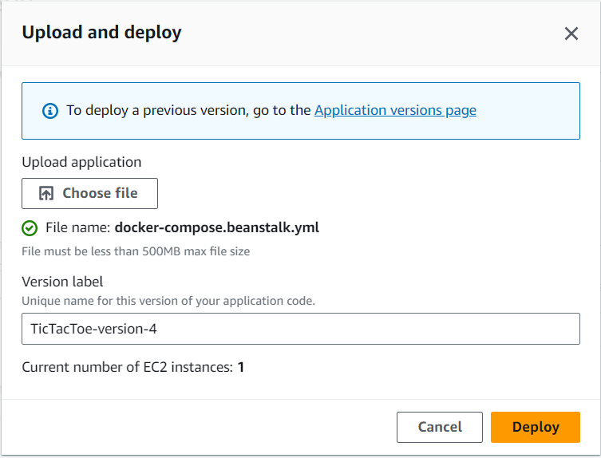
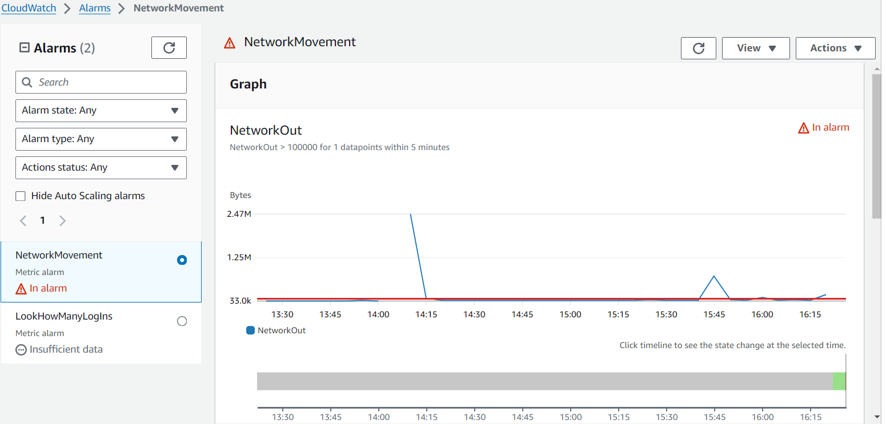
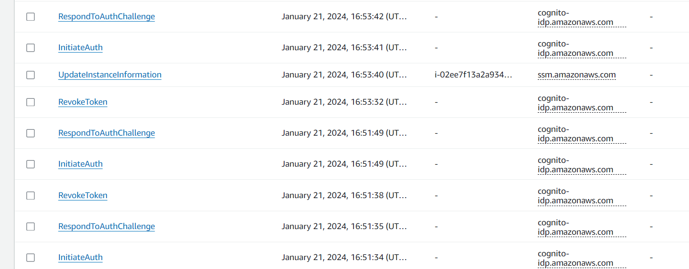

# AWS Tic-Tac-Toe App

This is a Angular + Spring Boot fullstack application involving the use of some AWS services.

The project consisted of 2 stages:
1. Basic implementation and manual deployment on EC2.
2. Elastic Beanstalk deployment and monitoring.

Software versions:
- Angular 17
- Spring Boot 3.2.1
- Java 21

## Features
- AWS Cognito authentication,
- Gameplay running on WebSocket connection,
- PostgreSQL database running on AWS RDS in production,
- Player ranking.

Home page


Waiting for a game


Gameplay


Ranking



## Stage 1 - basic implementation

### Prerequisites
- There is no mocking for Cognito user pool so you have to create one, even for development.

### AWS setup

#### EC2
Running on EC2 medium, because in the first iteration building is taking place right on the instance and it needed some more memory to do it in reasonable time.

Subject to be changed later.

#### Elastic IP
To ensure ip isn't changing along the way. Ip is embedded directly into frontend environment variables as backend endpoint address, which is a shortcut to be fixed.

#### Security groups
There will be 2 security groups:
- First one connecting EC2 instance to the outside world with an inbound rule on port 80 and 8080, allowing access to frontend and backend from anywhere;

- Second one connecting EC2 to our private RDS database. I used automatic setup. It allowed postgreSQL traffic on port 5432 from the ip of my EC2 instance.

### Running the containers
Wea are starting from a fresh new EC2 instance. Once again it should be at least medium cause building takes resources.

#### System setup

- install git ```sudo yum install git```
- clone the repo ```git clone --recursive https://github.com/kacpermejs/TicTacToeCloudApp.git```
- go inside ```cd TicTacToeCloudApp```
- add execution permission to the setup script ```chmod +x setup.sh```
- run the script ```./setup.sh```
- create .env file where you put the secrets ```touch .env```
- follow to the next paragraphs...

#### Secret environment variables
You have to create a .env file to be able to run the containers with docker compose. You can edit in in nano for example.

```
AWS_REGION=<aws region>
AWS_USER_POOL_ID=<cognito use pool id>
COGNITO_APP_CLIENT_ID=<cognito client id>
COGNITO_ISSUER_URI=https://cognito-idp.<aws region>.amazonaws.com/<cognito pool id>
COGNITO_JWK_SET_URI=https://cognito-idp.<aws-region>.amazonaws.com/<cognito pool id>/.well-known/jwks.json

POSTGRE_USERNAME=<db username>
POSTGRE_PASSWORD=<db password>
DB_URL=jdbc:postgresql://<rds endpoint or localhost for development>:5432/postgres

POSTGRE_DDL_AUTO=update #to create all the tables, change it later to prevent errors
```

#### Running

Our ```setup.sh``` installed docker and docker compose so now we use it to run our containers.

```docker compose --project-name tic-tac-toe --env-file .env up -d --build```

This will use production environment setup (docker-compose.yml by default).

For dev setup with localhost and embedded postgre container, build it with ```docker-compose.dev.yml```:

```docker compose -f .\docker-compose.dev.yml --project-name tic-tac-toe-dev --env-file .dev.env up -d --build```

## Stage 2 - new type of deployment and more improvements

It is a fresh start, we can forget about previous manual setup of EC2 instances. After thios stage there is quite a clear path towards creating a proper CI/CD pipeline.

For our new deployment we will be using:
- Elastic Beanstalk - new deployment environment running docker containers with a lot of room for custom configuration,
- Elastic Container Registry - kind of AWS's version of DockerHub,
- VPC and Security Groups - starting from scratch with new ones,
- RDS - also fresh database.

### Setup

1. Created new VPC with port 80 and 8080 exposed (80 is already exposed by default).



2. On the newly created VPC running the same kind of PostgreSQL database instance. Backend db url needs to me adjusted again.

3. Created beanstalk app and environment and attached it to previously created VPC.

4. It created its own Security Group where we have to allow PostgreSQL traffic form it on the Security Group where RDS database is running, by allowing inbound traffic from beanstalk group.



5. Tested with default sample app, and provided new domain for the frontend.

6. Apply required changes to docker-compose.yml. We need to set the image property to be able to push images automatically.



7. Built and uploaded backend and frontend images to ECR repositories with commands:
    - docker compose build
    - docker-compose push

8. Created a secret filled docker-compose.yml skipping build process thus making it take images from ECR.



9. Filled this file with secrets and uploaded it to beanstalk resulting in new app deployment.



10. Deployment complete!

We can easily implement CI/CD by doing image building and pushing with GitHub Actions for example.

### CloudWatch

Added sample alarm that is triggered by network movement. Tested it by repeatedly refreshing pages.



### CloudTrail

Added cloud trail logging where we can lookup when there were some cognito login actions.



